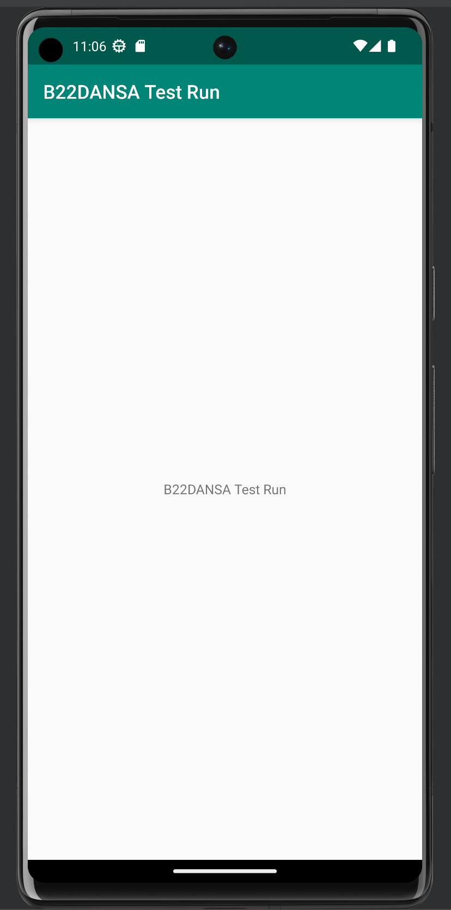

# Rapport

** 
    I detta assignment var uppgiften att skapa ett GitHub konto samt installera Android Studio.
Forka/clone ett projekt från Github och sedan ändra variabler i den. 
All arbete skulle vara utförd i Android Studio. 

De variablerna som ändrades var i string.xml och i AndroidManifest.xml filer. 

## Kod 

string.xml

    <string name="app_name">B22DANSA Test Run</string>
...

AndroidManifest.xml

    android:label="B22DANSA Test Run"
...
## Bild

**

